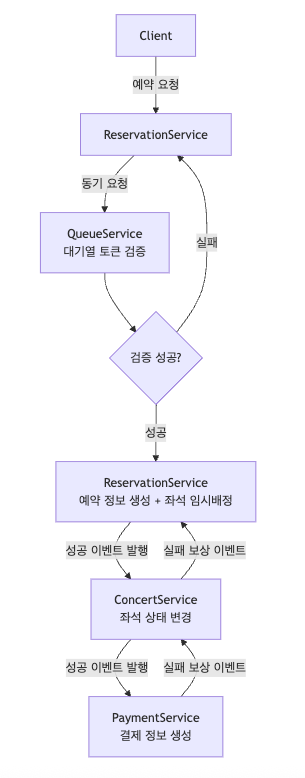
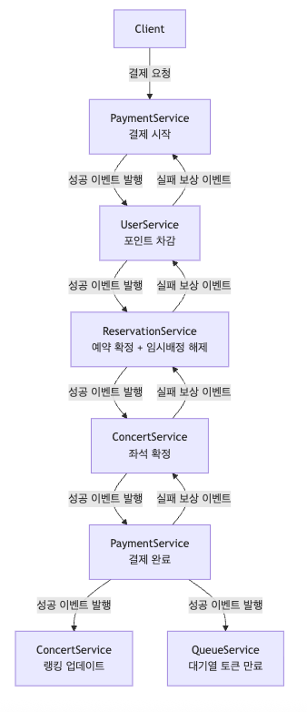

# MSA 설계

## 배포 단위
- Concert Service
  - 콘서트 정보
  - 콘서트 랭킹
- Queue Service
  - 대기열 토큰 관리
- Reservation Service
  - 예약 처리
  - 좌석 임시 배정
- Payment Service
  - 결제 처리
- User Service
  - 사용자 관리
  - 포인트 충전/차감

## 분리 후 트랜잭션 처리 문제점
### 좌석 예약
```
예약 요청 -> (Reservation Service)

대기열 토큰 검증 (Queue Service)
예약 정보 생성 + 좌석 임시 배정 (Reservation Service) 
좌석 상태 변경 (Concert Service)
결제 정보 생성 (Payment Service)
```
### 예약 결제
```
결제 요청 -> (Payment Service)

유저 포인트 차감 (User Service)
예약 상태 변경 + 좌석 임시 배정 해제 (Reservation Service)
좌석 상태 변경 (Concert Service)
결제 상태 변경 (Payment Service)
콘서트 랭킹 업데이트(Concert Service) // 좌석 매진 시
대기열 토큰 만료 (Queue Service)
```

각각 서비스별로 원자성은 보장되지만 전체적인 프로세스의 원자성이 보장되지 않는다

## 해결 방안 (코레오그레피 사가 패턴)
### 좌석 예약


QueueService의 대기열 토큰 검증은 동기적으로 요청
### 예약 결제

