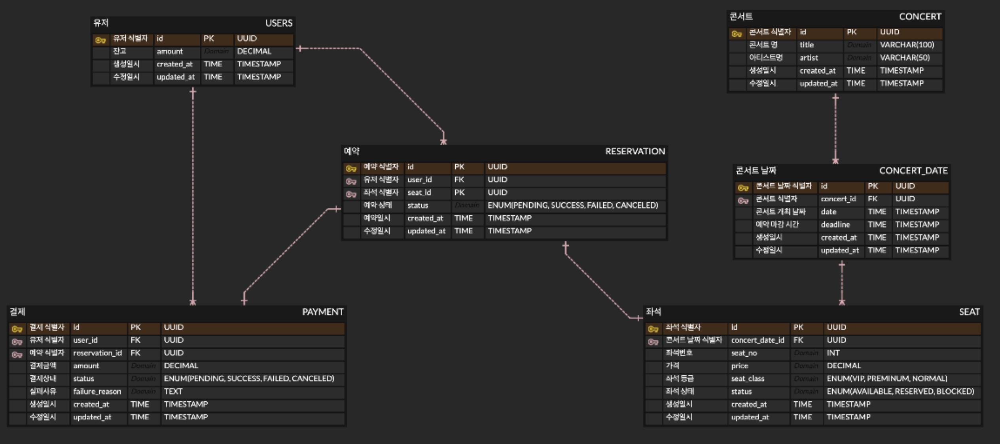

# ERD 구조


# 테이블 생성 쿼리
## 유저 테이블
```sql
CREATE TABLE `USERS` (
    `id` VARCHAR(36) NOT NULL COMMENT '사용자 UUID',
    `amount` DECIMAL(10,0) NOT NULL DEFAULT 0 COMMENT '보유 금액',
    `created_at` TIMESTAMP NOT NULL DEFAULT CURRENT_TIMESTAMP COMMENT '생성일시',
    `updated_at` TIMESTAMP NOT NULL DEFAULT CURRENT_TIMESTAMP ON UPDATE CURRENT_TIMESTAMP COMMENT '수정일시',
    PRIMARY KEY (`id`)
);
```
## 콘서트 테이블
```sql
CREATE TABLE `CONCERT` (
    `id` VARCHAR(36) NOT NULL COMMENT '콘서트 UUID',
    `title` VARCHAR(100) NOT NULL COMMENT '콘서트 제목',
    `artist` VARCHAR(50) NOT NULL COMMENT '아티스트명',
    `created_at` TIMESTAMP NOT NULL DEFAULT CURRENT_TIMESTAMP COMMENT '생성일시',
    `updated_at` TIMESTAMP NOT NULL DEFAULT CURRENT_TIMESTAMP ON UPDATE CURRENT_TIMESTAMP COMMENT '수정일시',
    PRIMARY KEY (`id`)
);
```

## 콘서트 날짜 테이블
```sql
CREATE TABLE `CONCERT_DATE` (
    `id` VARCHAR(36) NOT NULL COMMENT '콘서트 날짜 UUID',
    `concert_id` VARCHAR(36) NOT NULL COMMENT '콘서트 ID',
    `date` TIMESTAMP NOT NULL COMMENT '공연 일시',
    `deadline` TIMESTAMP NULL COMMENT '예약 마감일시',
    `created_at` TIMESTAMP NOT NULL DEFAULT CURRENT_TIMESTAMP COMMENT '생성일시',
    `updated_at` TIMESTAMP NOT NULL DEFAULT CURRENT_TIMESTAMP ON UPDATE CURRENT_TIMESTAMP COMMENT '수정일시',
    PRIMARY KEY (`id`),
    FOREIGN KEY (`concert_id`) REFERENCES `CONCERT`(`id`) ON DELETE CASCADE ON UPDATE CASCADE
);
```

## 좌석 테이블
> - 좌석 임시 배정 Redis 사용 구현
> - 좌석 번호에 따른 등급 및 가격 차등 적용
>  - 1~10 VIP
>  - 11~30 프리미엄
>  - 31~50 일반
```sql
CREATE TABLE `SEAT` (
    `id` VARCHAR(36) NOT NULL COMMENT '좌석 UUID',
    `concert_date_id` VARCHAR(36) NOT NULL COMMENT '콘서트 날짜 ID',
    `seat_no` INT NOT NULL COMMENT '좌석 번호 (1-50)',
    `price` DECIMAL(8,0) NOT NULL COMMENT '좌석 가격',
    `seat_class` ENUM('VIP', 'PREMIUM', 'NORMAL') NOT NULL COMMENT '좌석 등급',
    `is_assigned` BOOLEAN NOT NULL DEFAULT FALSE COMMENT '배정 여부',
    `created_at` TIMESTAMP NOT NULL DEFAULT CURRENT_TIMESTAMP COMMENT '생성일시',
    `updated_at` TIMESTAMP NOT NULL DEFAULT CURRENT_TIMESTAMP ON UPDATE CURRENT_TIMESTAMP COMMENT '수정일시',
    PRIMARY KEY (`id`),
    FOREIGN KEY (`concert_date_id`) REFERENCES `CONCERT_DATE`(`id`) ON DELETE CASCADE ON UPDATE CASCADE
);
```

## 결제 테이블
```sql
CREATE TABLE `PAYMENT` (
    `id` VARCHAR(36) NOT NULL COMMENT '결제 UUID',
    `user_id` VARCHAR(36) NOT NULL COMMENT '사용자 ID',
    `seat_id` VARCHAR(36) NOT NULL COMMENT '좌석 ID',
    `amount` DECIMAL(10,0) NOT NULL COMMENT '결제 금액',
    `status` ENUM('PENDING', 'SUCCESS', 'FAILED', 'CANCELLED') NOT NULL DEFAULT 'PENDING' COMMENT '결제 상태',
    `failure_reason` TEXT NULL COMMENT '결제 실패 사유',
    `created_at` TIMESTAMP NOT NULL DEFAULT CURRENT_TIMESTAMP COMMENT '생성일시',
    `updated_at` TIMESTAMP NOT NULL DEFAULT CURRENT_TIMESTAMP ON UPDATE CURRENT_TIMESTAMP COMMENT '수정일시',
    PRIMARY KEY (`id`),
    FOREIGN KEY (`user_id`) REFERENCES `USERS`(`id`) ON DELETE RESTRICT ON UPDATE CASCADE,
    FOREIGN KEY (`seat_id`) REFERENCES `SEAT`(`id`) ON DELETE RESTRICT ON UPDATE CASCADE
);
```

## 예약 테이블
```sql
CREATE TABLE `RESERVATION` (
    `id` VARCHAR(36) NOT NULL COMMENT '예약 UUID',
    `user_id` VARCHAR(36) NOT NULL COMMENT '사용자 ID',
    `seat_id` VARCHAR(36) NOT NULL COMMENT '좌석 ID',
    `payment_id` VARCHAR(36) NOT NULL COMMENT '결제 ID',
    `status` ENUM('SUCCESS', 'CANCELLED') NOT NULL COMMENT '예약 상태', 
    `created_at` TIMESTAMP NOT NULL DEFAULT CURRENT_TIMESTAMP COMMENT '생성일시',
    `updated_at` TIMESTAMP NOT NULL DEFAULT CURRENT_TIMESTAMP ON UPDATE CURRENT_TIMESTAMP COMMENT '수정일시',
    PRIMARY KEY (`id`),
    FOREIGN KEY (`user_id`) REFERENCES `USERS`(`id`) ON DELETE RESTRICT ON UPDATE CASCADE,
    FOREIGN KEY (`seat_id`) REFERENCES `SEAT`(`id`) ON DELETE RESTRICT ON UPDATE CASCADE,
    FOREIGN KEY (`payment_id`) REFERENCES `PAYMENT`(`id`) ON DELETE RESTRICT ON UPDATE CASCADE
);
```