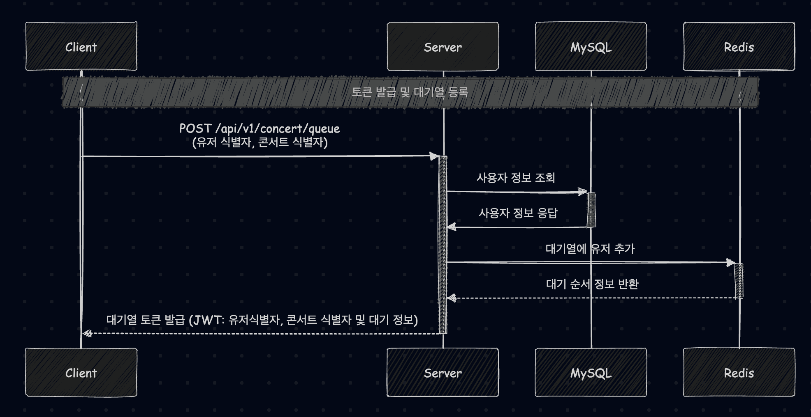
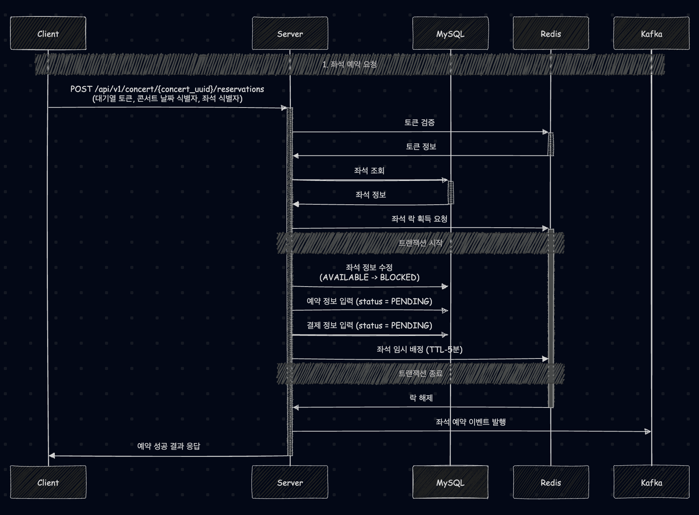
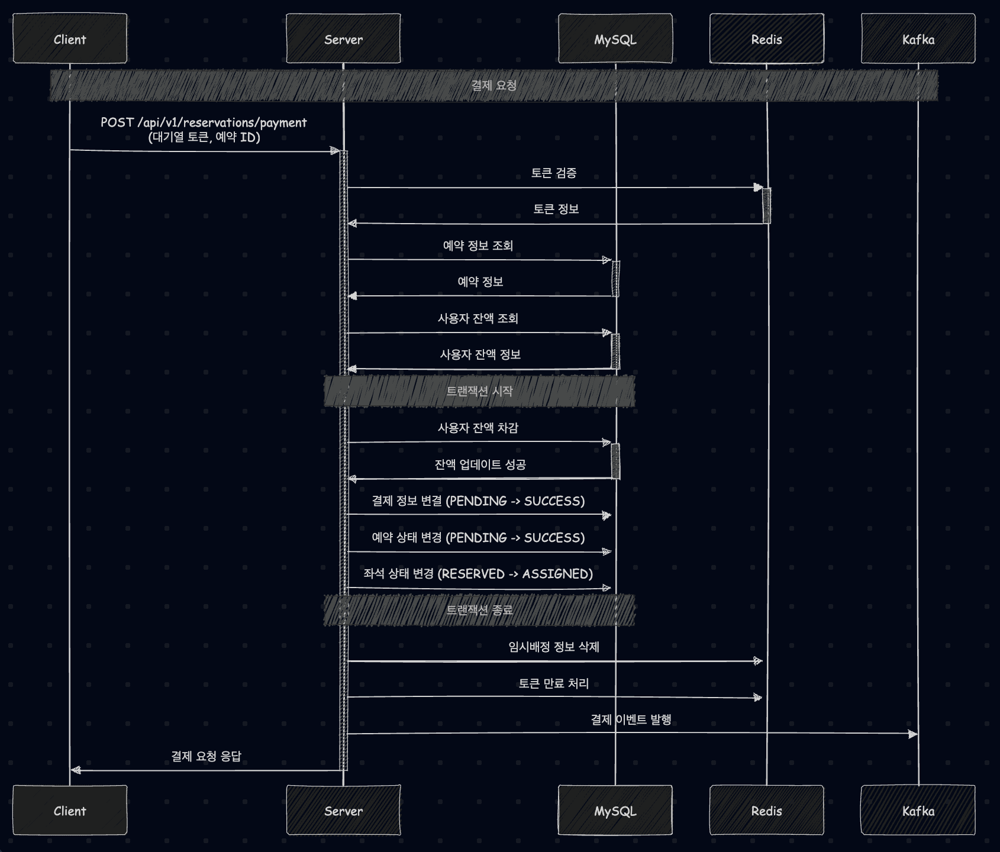

# 유저 대기열 토큰 발급

> 사용자 정보 찾을 수 없음: 404 Not Found

# 좌석 예약 요청

> 토큰 존재 X, 만료, 잘못되었을 시: 401 Unauthorized  
> 좌석 정보 찾을 수 없음: 404 Not Found  
> 좌석 정보 - BLOCKED,  ASSIGNED: 400 Bad Request  
> 락 획득 실패: 409 Conflict  

# 결제 요청

> 토큰 존재 X, 만료, 잘못되었을 시: 401 Unauthorized   
> 예약 정보 찾을 수 없음: 404 Not Found  
> 사용자 찾을 수 없음: 404 Not Found  
> 사용자 잔액 부족: 400 Bad Request  

