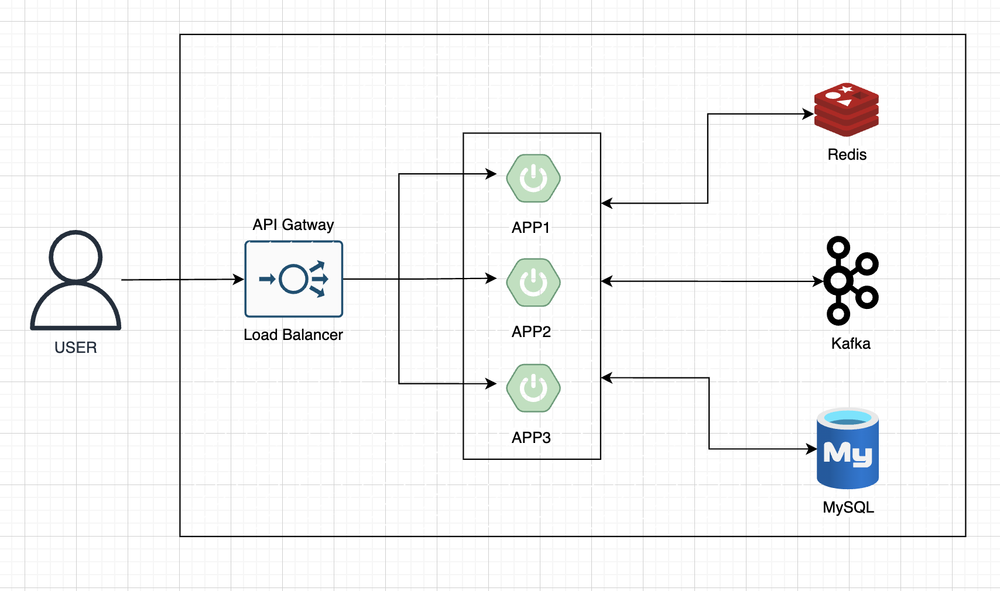

# 인프라 구성도 

## Client
기본적으로 HTTP/HTTPS를 사용하여 API 호출
유저 대기열 토큰 발급과 동시에 WebSocket 연결을 통해 현재 대기열 정보 확인

## API Gateway
Nginx를 사용해 로드밸런싱과 리버스 프록시, 정적 리소스 캐싱 용도 사용

## Appications
모놀리틱 구조로 수평 확장함

## Redis
캐시 서버로 활용  
유저 대기열 관리 및 유저 대기열 토큰 저장소  
좌석 임시 배정  
분산 락 (동시성 제어)

## Kafka
결제, 예약 등 이벤트 처리

## MySQL
데이터 영구 저장소
