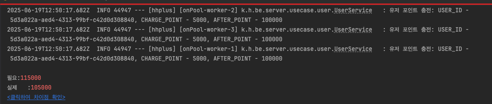
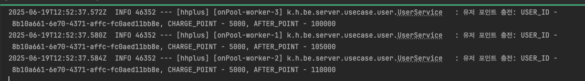
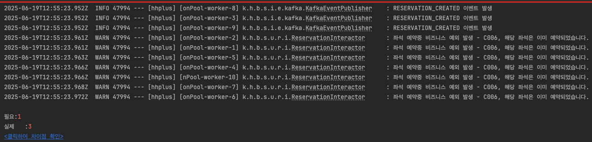
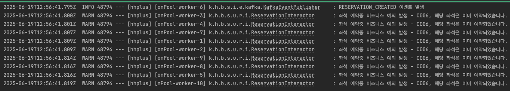
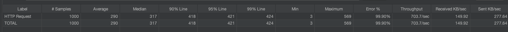
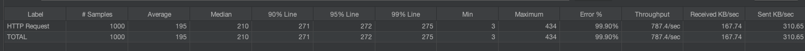
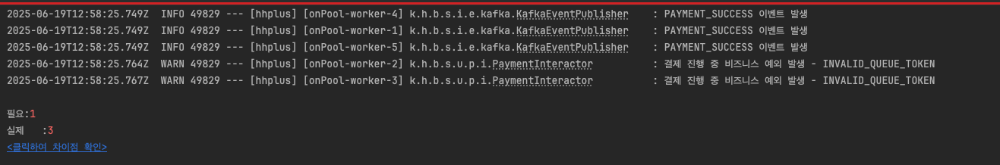
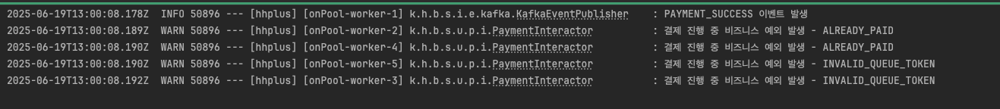

# 동시성 문제 해결 보고서

## 1. 동시 포인트 충전 문제

### 문제 상황
#### - 현상: 여러 사용자 동시에 포인트를 충전할 때, 잔액 업데이트가 정상적으로 처리되지 않는 문제
#### - 원인: 동시에 같은 사용자의 잔액을 조회하고 업데이트하는 과정에서 Lost Update 문제 발생
#### - 예상 시나리오:
    - 초기 잔액: 10,000원
    - Thread A: 5,000원 충전 요청
    - Thread B: 3,000원 충전 요청
    - 예상 결과: 18,000원 → 실제 결과: 13,000원 또는 15,000원

### 멀티스레드 테스트 로그


### 해결 전략
#### - 선택한 방법: 비관적 락
#### - 근거:
    포인트 충전의 충돌 가능성은 낮다고 생각된다.
    하지만 데이터 정합성이 최우선이라고 생각되어 비관적 락 적용

```java
@Query("select u from UserEntity u where u.id = :userId")
@Lock(LockModeType.PESSIMISTIC_WRITE)
Optional<UserEntity> findByIdForUpdate(String userId);
```
- 테스트: [UserConcurrencyTest.java](../../src/test/java/kr/hhplus/be/server/api/user/UserConcurrencyTest.java)

### 결과 

---


## 2. 동시 좌석 예약 문제

### 문제 상황
#### - 현상: 동일한 좌석에 대해 여러 사용자가 동시에 예약을 시도할 때, 중복 예약이 발생하는 문제
#### - 원인: 좌석 상태 확인과 업데이트 사이의 Race Condition
#### - 예상 시나리오:
    - 좌석 A가 AVAILABLE 상태
    - User1, User2가 동시에 좌석 A 예약 시도
    - 두 사용자 모두 예약 성공하는 문제 발생

### 멀티스레드 테스트 로그


### 해결 전략
#### - 선택한 방법: 조건부 업데이트
#### - 근거:
    좌석 예약은 많은 충돌이 예상된다.
    하지만 특정 피크 시간에 요청이 몰리는 만큼 TPS와 빠른 응답이 중요하다고 생각한다.
    실패 시 재시도 보다 즉시 실패 응답을 반환하는 것이 적합하다고 판단하여 조건부 업데이트 적용

```java
@Query("""
    update SeatEntity
        set status = 'RESERVED'
    where id = :seatId
        and status = 'AVAILABLE'
""")
@Modifying
int updateStatusReserved(String seatId);
```
- 테스트: [ReservationConcurrencyTest.java](../../src/test/java/kr/hhplus/be/server/api/reservation/ReservationConcurrencyTest.java)

### 결과


### Jmeter 부하테스트
    Threads: 1000
    Ramp-up period: 1
#### - Seat 비관적 락


#### - Seat 조건부 업데이트


| 항목                 | **비관적 락**         | **조건부 업데이트**      | **우세 전략**          |
| ------------------ | ----------------- | ----------------- | ------------------ |
| **Avg 응답시간 (ms)**  | **290 ms**        | **195 ms**        | ✅ 조건부 (35% 빠름)     |
| **Median (P50)**   | 317 ms            | 210 ms            | ✅ 조건부              |
| **P90**            | 418 ms            | 271 ms            | ✅ 조건부              |
| **P95**            | 421 ms            | 272 ms            | ✅ 조건부              |
| **P99**            | 424 ms            | 275 ms            | ✅ 조건부              |
| **최소 / 최대 (ms)**   | 3 / 569           | 3 / 434           | ✅ 조건부 (최대 응답 낮음)   |
| **TPS**            | **703.7 req/sec** | **787.4 req/sec** | ✅ 조건부 (\~12% 더 높음) |


    조건부 업데이트가 비관적 락 보다 TPS와 응답시간에서 높은 성능을 보인다
---

## 3. 동시 결제 문제

### 문제 상황
#### - 현상: 동일한 결제에 대해 여러 번 처리되어 중복 결제가 발생하는 문제
#### - 원인: 결제 상태 확인과 업데이트 사이의 Race Condition
#### - 예상 시나리오:
    - Payment가 PENDING 상태
    - Thread1, Thread2가 동시에 Payment A 결제 시도
    - 두 스레드 모두 결제 성공하여 중복 처리 발생

### 멀티스레드 테스트 로그


### 해결 전략
#### - 선택한 방법: 비관적 락
#### - 근거:
    결제의 충돌 가능성은 낮다고 생각되지만 발생 시 크리티컬 하다고 생각된다.
    따라서 충돌 가능성은 낮더라도 정합성이 최우선이라고 생각되어 비관적 락 적용

```java
@Query("select p from PaymentEntity p where p.reservationId = :reservationId")
@Lock(LockModeType.PESSIMISTIC_WRITE)
Optional<PaymentEntity> findByReservationIdForUpdate(String reservationId);
```
- 테스트: [PaymentConcurrencyTest.java](../../src/test/java/kr/hhplus/be/server/api/payment/PaymentConcurrencyTest.java)

### 결과



| 지표                  | 비관적 락 (1차)    | 조건부 업데이트 (2차) | 
| ------------------- | ------------- | ------------- | 
| **총 요청 수**          | 100           | 100           | 
| **TPS (처리량)**       | **588.2 TPS** | **227.3 TPS** | 
| **Avg 응답시간**        | **31 ms**     | **438 ms**    | 
| **Latency (평균 지연)** | 219.5 ms      | 219.5 ms      | 
| **Error %**         | **0%**        | **>100%**     | 
